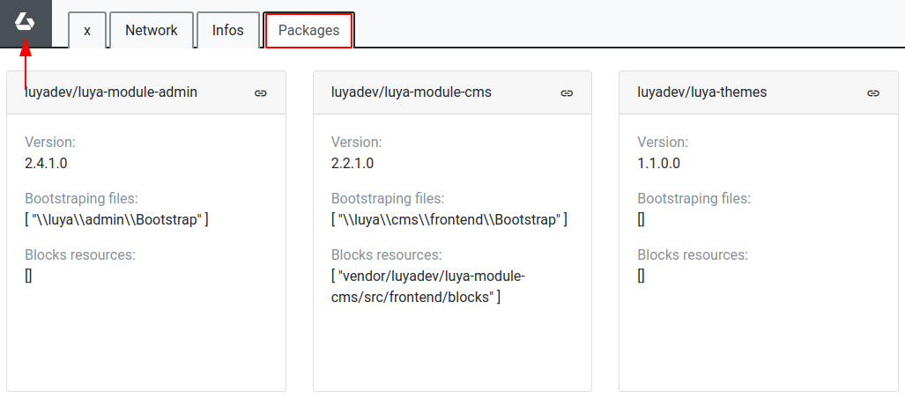

# Project Module

A very important behavior in *LUYA* projects are **modules**. You can always use modules to put your own custom and reusable logic inside. 
For instance you can put database logic inside of the ActiveRecord models. A module can also provide information for other module, e.g.  [CMS Blocks](/guide/cms/blocks). 



## Module Types

There are two different types of modules:

+ [Admin](/guide/admin/intro) - Contains Models, Migrations Administration, [NgRest CRUD](../ngrest/).
+ [Frontend](/guide/frontend/intro) - Contains controllers and views, logic for frontend implementations.

::: tip
In order to create your custom module you can run the [Console Command](/guide/app/console) `module/create` wizard.
:::

Structure of modules

```
.
├── admin
│   ├── assets
│   ├── apis
│   ├── importers
│   ├── controllers
│   ├── migrations
│   └── resources
├── frontend
│   ├── assets
│   ├── controllers
│   ├── blockgroups
│   ├── blocks
│   └── views
├── models
└── helpers
```

### Use and configure

To integrate a module you have to define it in your config file `env-prep.php` and / or `env-prod.php`, it depends on which environment your `env.php` is returning.
E.g. add this to your configs in the modules section:

```php
$config = [
    'modules' => [
        'contact'=> 'app\modules\team\Module'
    ]
];
``` 

## Example module

In our example we make a *TEAM module* which has a frontend and admin module part. All admin modules have by defintion the suffix **admin**, the naming of the modules would look like this in our case:

+ team *Frontend* `modules/frontend/Module.php`
+ teamadmin *Admin* `modules/admin/Module.php`


```php
<?php
namespace app\modules\team\frontend;

class Module extends \luya\base\Module
{

}
```

The *Admin* module `modules/teamadmin/Module.php`:

```php
<?php
namespace app\modules\team\admin;

class Module extends \luya\admin\base\Module
{

}
```


## Import Method

All modules can contain a <class name="luya\admin\base\Module" method="import" /> method wich will be called when running the [console command `import`](/guide/app/console). 
If <class name="luya\admin\base\Module" method="import" /> method returns an array each class must extend from the <class name="luya\console\Importer" /> class.

> One of the main ideas behind LUYA is to store data in files and import them into your database.

Example response for multiple importer classes:

```php
public function import(\luya\console\interfaces\ImportController $import)
{
    return [
        '\\luya\\cms\\importers\\BlockImporter',
        '\\luya\\cms\\importers\\CmslayoutImporter',
    ];
}
```

Example code where import directly does handle some code:

```php
public function import(\luya\console\interfaces\ImportControllerInterface $import)
{
    foreach ($import->getDirectoryFiles('filters') as $file) {
        $filterClassName = $file['ns'];
        if (class_exists($filterClassName)) {
            $object = new $filterClassName();
            $import->addLog('filters', implode(", ", $object->save()));
        }
    }
}
```

## PSR-4 binding with Composer

Sometimes you do not want to use the long namespaces names like `app\modules\mymodule` and create a shortcut to access your files. In order to add a shorter *alias* to your namespace you psr-4 bind them in your `composer.json` file. 
To do so open the `composer.json` file and add the *autoload* section (if not exists):

```json
"autoload" : {
    "psr-4" : {
        "mymodule\\" : "app/modules/mymodule"
    }
}
```

Run the `composer dump-autoload` command in order to refresh the autoload section of your Composer file. Now you are able to access the *app/modules/mymodule* files directly with the *mymodule* module namepsace.