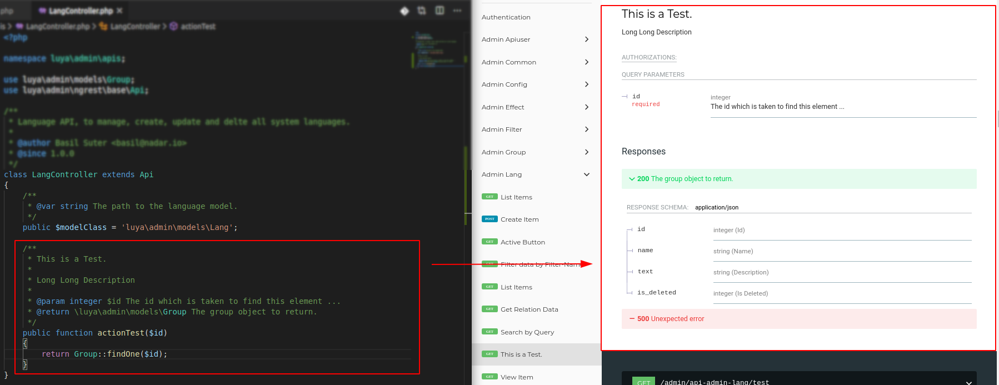
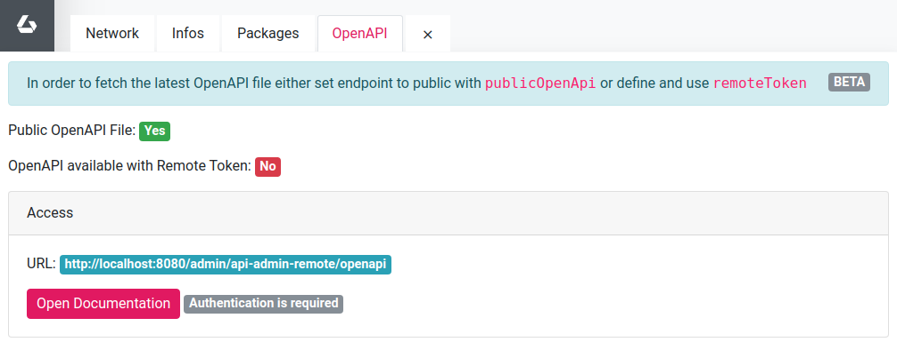
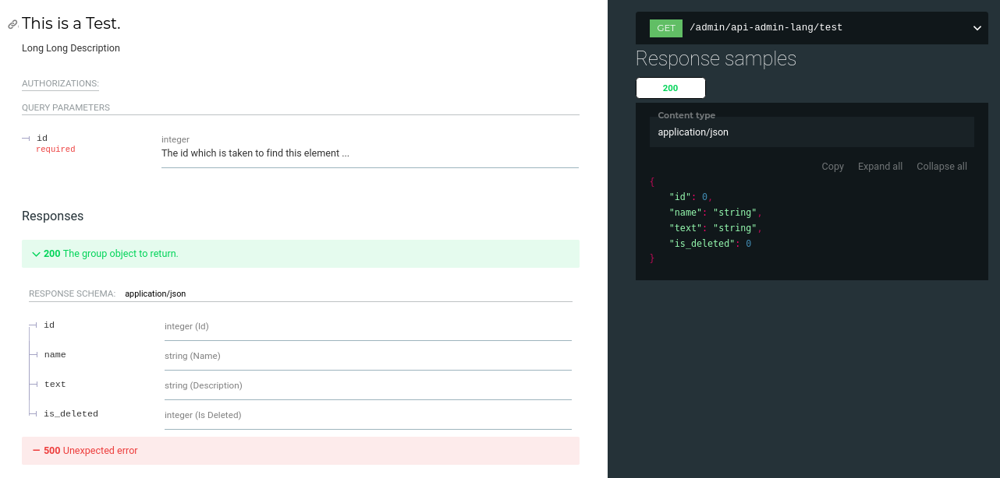

# OpenAPI Generator

Since version 3.2 of LUYA Admin Module an OpenAPI file generator is available. The generator creates a JSON OpenAPI Defintion based on all REST UrlRules and routes provided with ControllerMap.

The purpose of the generator is to have documentation where it should belong, in the code, but also provide those descriptions to the Endpoint Consumers.



## Enable OpenAPI Endpoint

::: warning
To generate the OpenAPI File the `cebe/php-openapi` Composer package is required, install the library with `composer require cebe/php-openapi`.
:::

In order to enable the OpenAPI Endpoint you can either use `remoteToken` or ` publicOpenApi` property:

+ `remoteToken`: If a `luya\web\Application::remoteToken` is defined, the `?token=sha1($remoteToken)` param can be used to retrieve the OpenAPI defintion: `https://yourdomain.com/admin/api-admin-remote/openapi?token=8843d7f92416211de9ebb963ff4ce28125932878` (where token is an sha1 encoded value of remoteToken)
+ `publicOpenApi`: Enable `luya\admin\Module::$publicOpenApi` will expose the Endpoint `https://yourdomain.com/admin/api-admin-remote/openapi` to everyone, without any authentication or token.

When developer settings are enabled in User Profile (Preferences -> General -> Developer Mode), a new debug panel with OpenAPI informations is shown:



## ReDoc Viewer

When logged into the Admin Module, the Documentation can be explored in real time, either open the Developer Panel and click `Open Documentation Explorer` or enter `https://yourdomain.com/admin/default/api-doc`.

## PHP Documentation

The details, descriptions and paramters or mostly read from the PHPDoc blocks, this means documentation inside the code will be exposed to the API Consumers, thefore its finally absolute worth to take time making propper documentations. This will make other developers, yourself and API Consumers happy. The LUYA OpenAPI generator can interpret reference to objects and classes, will follow them and publish those to the OpenAPI.

An example of an LUYA Admin API Defintion:

```php
/**
 * Short Description.
 *
 * Long multi line description.
 * Long multi line description.
 * Long multi line description.
 */
class LangController extends Api
{
    public $modelClass = 'luya\admin\models\Lang';

    /**
     * This is a Test.
     *
     * Long Long Description
     * 
     * @param integer $id The id which is taken to find this element ...
     * @return \luya\admin\models\Group The group object to return.
     */
    public function actionTest($id)
    {

    }
}
```

The above `luya\admin\ngrest\base\Api` will be generate all the `luya\rest\ActiveController` actions like list, detail view, create, update and delete. The specifications will be taken from the ActiveRecord isntance defined in $modelClass (luya\admin\models\Lang in the above case).

The `actionTest()` requires an param `$id` and will return a `luya\admin\models\Group` instance defined in PHP Doc, therefore this is what would be rendered:



When Parsing ActiveRecords the `@property` values of a class will be interpreted as well as `attributeLabels()` and `attributeHints()`.

### Request Body

With introduction of LUYA Admin OpenAPI Generator we make use of the `@uses` tag to reference POST Request Bodies. As the POST data is not defined in the `@param` section we recommend to use `@uses`:

```php
/**
 * @uses app\models\PostSaveModel The model which is taken as request body.
 */
public function actionPostSave()
{
    // ..
}
```

The above example defines the `$_POST` fields based on the object properties and attributes. For a none object definition related definitions:

```php
/**
 * @uses string username
 * @uses string password
 */
public function actionPostSave()
{
    // ..
}
```

Which would be equals to `$_POST['username']` and `$_POST['password']`.

### Working with actions() Array

With the Yii Framework its very convient to make use of `actions()` definition as array inside a controller. This allows to easy share actions among controllers. The downside of this behavior is the Description and Title of those Actions are always the same. So the OpenAPI documentation for those actions like REST actions `actionIndex()`, `actionUpdate($id)`, `actionView($id)` are all the same. In order to fix this problem we encourage you to use [@method](https://docs.phpdoc.org/latest/references/phpdoc/tags/method.html) PHPDoc Param this will also improve the documentation of your code and generate correctly meaningful OpenAPI documentations.

```php
<?php
/**
 * @method app\models\User[] actionIndex() Returns all user along with ........
 */
 class MyApiController
 {
     public function actions()
     {
         return [
             'index' => ['class' => 'yii\rest\IndexAction']
         ];
     }
 }
```

## Change Verb

In order to ensure all the actions have the correct verbs its recommend to use the `luya\base\Module::$rulRule` variable, which can declare or override actuall `yii\rest\UrlRule` patters or add extraPattersn:

An example of how to defined whether an actrin is only allowed for post or not, which is also taken into account when rendering the OpenAPI file:

```php
public $apiRules = [
    'api-admin-timestamp' => [
        'patterns' => [
            'POST' => 'index',
        ]
    ],
    'api-admin-user' => [
        'extraPatterns' => [
            'POST change-password' => 'change-password',
        ]
    ]
];
```

The first example will map `POST api-admin-timestamp` to the index action, the second example ensures that action `change-password` can only run as POST request.

## OpenAPI Client

In order to consum the OpenAPI trough OpenAPI Client you have to turn off `luya\admin\Module::$jsonCruft` behavior in the `luya\Config` for the Admin Module:

```php
 'admin' => [
    'class' => 'luya\admin\Module',
    'jsonCruft' => false,
    // ...
 ]
```

Currently test client generators:

+ https://github.com/janephp/janephp
