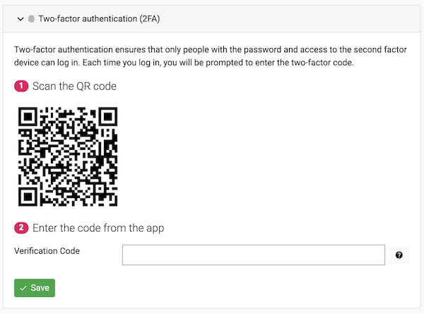

# Security

A few tips to increase the security of your LUYA application in a production environment.

## Webserver & Files

Make sure that your webserver points to the `public_html` directory, otherwise sensitive data contained in files might be exposed to the public. Preventing exposure is especially important with yml or env files. Therefore make sure not to commit the `.env` file from Docker, as it may contain your access token!

## DNS Wildcard

Use the <class name="luya\web\Composition" prop="allowedHosts" /> property inside the composition component in order to prevent DNS wildcard hijacking.

```php
'composition' => [
    'allowedHosts' => [
        'prep.testserver.com', '*.productionserver.com',
    ]
]
```

## Secure Connection

In production environments, HTTPS should always be enabled in order to prevent man-in-the-middle attacks. HTTPS can be enabled in the htaccess file or webserver configuration. To enforce HTTPS on an application level (throwing exceptions for non HTTPS calls), use the ensureSecureConnection application property.

```php
return [
    'id' => 'myapp',
    // ...
    'ensureSecureConnection' => true,
]
```

When enabling `ensureSecureConnection` a few other security mechnism are triggered as well, like cookies use secure flag and a few headers will be set `Strict-Transport-Security`, `X-XSS-Protection`, `X-Frame-Options => "SAMEORIGIN"` in order to prevent [Clickjacking](https://de.wikipedia.org/wiki/Clickjacking).

## Secure login

We recommend to enable <class name="luya\admin\Module" prop="secureLogin" /> which will send you a token by email you have to enter. As maybe your customers do not use strong passwords we recommend to enable this option. In order to use $secureLogin your mail component must be configure well in order to send emails with secure tokens.

```php
'admin' => [
    'class' => 'luya\admin\Module',
    'secureLogin' => true,
]
```

Since admin version 3.0 its also possible to setup 2FA login wiht OTP trough any authenticator app.



## Strong admin user password policy

We recommend to enable the <class name="luya\admin\Module" prop="strongPasswordPolicy" /> property which is availabe since `luya-module-admin` version 1.1.1 and enabled by default since 1.2.0. This property makes sure the user has to enter a strong password with: uppercase, lowercase, special chars, digits and numbers with an min length of 8 chars.

```php
'admin' => [
    'class' => 'luya\admin\Module',
    'strongPasswordPolicy' => true,
]
```

## Email verification

With enabling of <class name="luya\admin\Module" prop="emailVerification" /> the user can not change its e-mail until the verification code (which has been sent to the current email) has been entered. This makes it harder to overtake the current account and also not to lock yourself out by entering a wrong email.

```php
'admin' => [
    'class' => 'luya\admin\Module',
    'emailVerification' => true,
]
```

## JSON response cruft prepend

A JSON vulnerability allows third party website to turn your JSON resource URL into JSONP request under some conditions. To encounter this, the server can prefix all JSON requests with following cruft `")]}',\n"`. This is auto enabled for all JSON responses which are provided by the admin module trough the APIs.

```php
'admin' => [
    'class' => 'luya\admin\Module',
    'jsonCruft' => true,
]
```

You should never disabled this behavior, but if you are unable to parse the response content you can turn it off. Every response which contains a prepend cruft has the response header `X-CRUFT-LENGTH` therefore you can remove the first chars with this length, like the LUYA headless client does.

## Deployment

We recommend to use the [LUYA deployer](https://github.com/luyadev/luya-deployer) in order to deploy your website. To do so you have to provide credentials to your VCS and webserver. In order to increase security, you should use a `PEM` file to make the webserver connection. By default, the LUYA deployer will remove sensitive files like `README`, `deployer.php`, `composer.json`, `composer.lock` and `.git` data after deployment.
