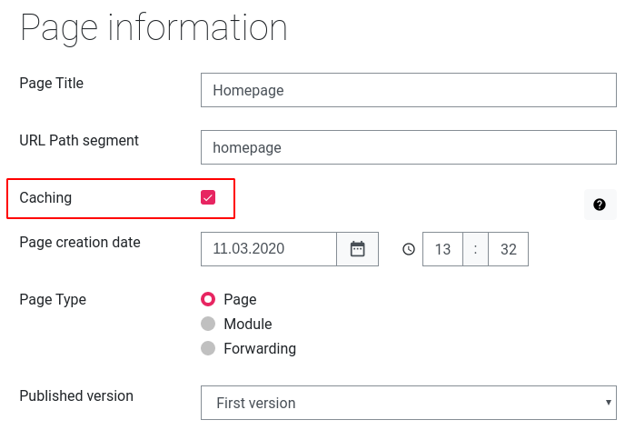

# Page Speed

There are a few things you can do to speed up your application when running LUYA in production environment.

## Caching

You should always enable caching in production! Caching stores data inside the runtime folder which will reduce the number of SQL requests. The LUYA admin UI and CMS module are using the caching system where often for large and time consuming tasks.

In order to enable the caching, open your config and add the caching to the components section:

```php
'components' => [
    'cache' => [
        'class' => 'yii\caching\FileCache',
    ]
]
```

> When using LUYA deployer, the runtime folder will be recreated for each deployment. You can also force recaching by click the reload button in the admin UI.

There are also a few other caching mechanism available and built in into Yii. See the [supported cache storage](http://www.yiiframework.com/doc-2.0/guide-caching-data.html#supported-cache-storage)

## Page Caching

> since CMS 3.0

It is als possible to cache the whole page response. This dramatically improves the page speed and is recommend to setup whenever its possible. By default the data is in the cache for 2 hours but will be destroyed when you edit or move blocks around on the given page.



Keepp in mind, that when enabled, the whole page will be cached including all blocks, therefore **dynamically generated data in blocks will not be updated**!

## Database

In order to reduce the SQL requests you can also enable schema caching in your database component which will only work if you have defined a caching mechanism from above.

```php
'components' => [

    // ...
    
    'db' => [
        'class' => 'yii\db\Connection',
        // ...
        'enableSchemaCache' => true,
    ]
]
```

When dealing with large database tables in your application you should define database indexes (for example when working with MySQL).

## Session

> since Admin 3.9

The admin provides an out of the box table which can be taken to store the session inside the database, thereore just configured:

```php
 $config->component('session', [
    'class' => 'yii\web\DbSession',
    'sessionTable' => 'admin_session',
]);
```
