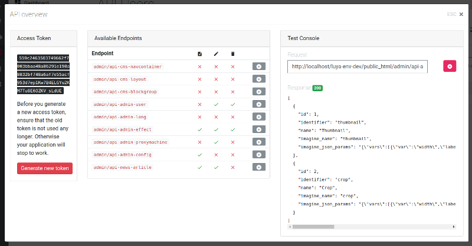

# LUYA Headless system

As LUYA is built upon the concept of REST APIs, providing headless access to the database content of LUYA is a no brainer. You can either access the [[ngrest.md]] APIs or the CMS admin APIs. Since LUYA admin version 1.1.0 we've added the ability to create API-Users and an overview of which endpoints they can request data from:



In order to see the API Users menu make sure to use luya-admin module in version ~1.1.0 and your group has all permissions.

## API User

With introduction of Headless System a new API User layer has been introduced. API Users are almost like other users with the following differences:

+ The Access Token can be viewed and changed.
+ Request can be tracked in order to debug or find bottlenecks.
+ Log entries won't be generated by default, as API users might make thousends of entries, depending of the application.
+ Access tokens can be revereted.
+ API Users are unable to login into the admin area (trough UI)
+ None, one or more permission groups can be assigned to an API User.

## PHP Client

[LUYA Headless Client](https://luya.io/packages/luyadev--luya-headless): Read the [LUYA Headless client documentation](https://luya.io/packages/luyadev--luya-headless) in order to see how to make calls!

## JWT

In order to configure JWT authentification read more in the JWT & SPA Section: [[app-admin-module-jwt-spa.md]].

## CMS Bridge

In addition to the existing APIs for the CMS, we have also made a module which exposes all required CMS data to a public API, see the [CMS API Bridge Module](https://github.com/luyadev/luya-headless-cms-api). With this module no authorizaion process is required and there are APIs which makes its more easy to consum the data instead of gathering the data by yourself trough the OpenAPI description.

## Additional Configuration

If you build a website with the LUYA CMS but use the headless client to render the content, you may want to configure the preview URL to point to your headless page.

```php
'modules' => [
    'cmsadmin' => [
        'class' => 'luya\cms\admin\Module',
        'previewUrl' => 'https://mywebsite/preview/page',
    ],
]
```

To extend, improve or speed up your APIs, take a look at [[ngrest-api.md]] guide section.
