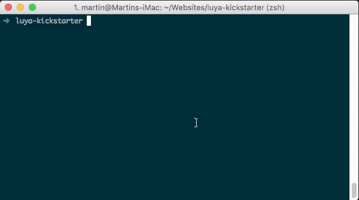
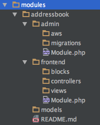
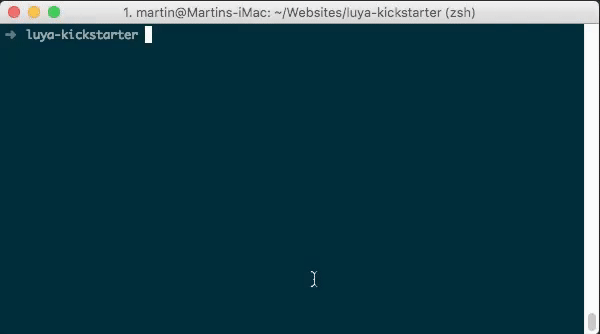
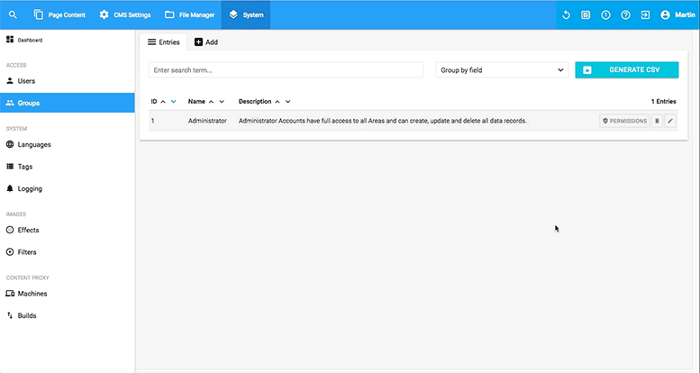
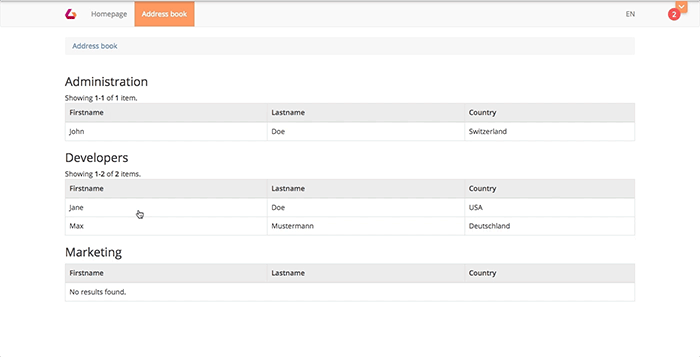

# How to create a LUYA module

In this lesson we are going to create a module which handles all basic needs for maintaining a simple address book. We will create the module, learn about the CRUD interface, establish an URL route and learning about the two ways of a possible module frontend presentation. 

Our starting point is a fresh [LUYA kickstarter installation](https://luya.io/guide/install).

## Create the module using the LUYA code wizard

As described in the [LUYA  guide](https://luya.io/guide/app-admin-module) we will create the module by using the LUYA code wizard:

`./vendor/bin/luya module/create`

See the GIF below:



After successfully executing you'll notice the created file structure in the `modules/addressbook` directory:



## Configure the module

To register the module in LUYA you [have to edit the config file](https://luya.io/guide/app-module) according to your working environment. We will edit the `configs/env-local.php` because we are developing in the local environment. To register both modules (admin and frontend), we are adding the `addressbook` and `addressbookadmin` module to the existent module section in the config file:

```php
'modules' => [
    /* ... */
        
    'addressbook' => [
        'class' => 'app\modules\addressbook\frontend\Module',
        'useAppViewPath' => true, // When enabled the views will be looked up in the @app/views folder, otherwise the views shipped with the module will be used.
    ],
    'addressbookadmin' => 'app\modules\addressbook\admin\Module',
],
```

> When creating an open source module, you should provide frontend views which the the developer then could trough `useAppViewPath` or not.

## Creating the models and migrations

Our first step for the creation of our data model and the migration files is to create the associated database tables.
Again, we're using the code wizard to [create the migration file](https://luya.io/guide/ngrest-concept) for our registered admin module **addressbookadmin**. We will need two tables, one for the contact data itself and one for the different contact groups.

```sh
./vendor/bin/luya migrate/create addressbook_basetables addressbookadmin
```

You will find the migration file in `modules/addressbook/admin/migrations/`.

### Adding migration details

We will provide a basic data set (first name, last name, etc.) for the contact details and only a name and id for the group table. 

Your migration file should look like this:

```php
<?php

use yii\db\Migration;

class m170509_135035_addressbook_basetables extends Migration
{
    public function safeUp()
    {
        $this->createTable('addressbook_contact', [
            'id' => $this->primaryKey(),
            'group_id' => $this->integer()->notNull(),
            'salutation' => $this->string(),
            'firstname' => $this->string()->notNull(),
            'lastname' => $this->string()->notNull(),
            'street' => $this->string(),
            'zip' => $this->string(100),
            'city' => $this->string(),
            'country' => $this->string(),
            'email' => $this->string(),
            'notes' => $this->text(),
        ]);

        $this->createTable('addressbook_group', [
            'id' => $this->primaryKey(),
            'name' => $this->string()->notNull(),
        ]);
    }

    public function safeDown()
    {
        $this->dropTable('addressbook_contact');
        $this->dropTable('addressbook_group');
    }
}
```

Note that your migration class name will differ because of the included timestamp.

### Executing the migrations

To create the database tables from the migration files, you have to execute the `migrate` console command:

```sh
./vendor/bin/luya migrate
```

### Creating the models

Again we are using the LUYA code wizard to help us create the corresponding models with a pre configured CRUD view for the database tables:

```sh
./vendor/bin/luya admin/crud/create
```

Below you see how to use the wizard to automatically create the contact model `models/Contact.php` and all associated files like the API controller `modules/addressbook/admin/apis/ContactController.php` and the controller `modules/addressbook/admin/controllers/ContactController.php`:



Repeat the process for the `Group` model.

## Adding the module to the admin menu

In order to see the new module, you have to define the menu appearance in the `modules/addressbook/admin/Module.php`. After successfully executing the `admin/crud/create` command you will also get a generated code proposal (green color) in the command line (see the GIF above). We want to see both the contacts and the groups in the admin menu and have to modify the generated code accordingly.

Your admin `Module.php` should look like this:

```php
<?php

namespace app\modules\addressbook\admin;

/**
 * Addressbook Admin Module.
 *
 * File has been created with `module/create` command on LUYA version 1.0.0. 
 */
class Module extends \luya\admin\base\Module
{
    public $apis = [
        'api-addressbook-contact' => 'app\modules\addressbook\admin\apis\ContactController',
    ];

    public function getMenu()
    {
        return (new \luya\admin\components\AdminMenuBuilder($this))
            ->node('Contact', 'extension')
            ->group('Group')
            ->itemApi('Contact', 'addressbookadmin/contact/index', 'label', 'api-addressbook-contact');
    }
}
```

## Importing the module

Finally, we are going to import the new modules with the import command:

```
./vendor/bin/luya import
```

Before we will see the module in the admin view, we have to set the permissions for the `addressbookadmin` for our user in `System/Groups/Permissions`:



## Linking the group table in the contact table

We do not want to put the group ID in a contact record. In order to get a nice dropdown with all available `Groups`, we have to modify the `ngRestAttributeTypes()` function in the `Contact.php` model. We will use the [selectModel](https://luya.io/guide/ngrest-plugin-select) attribute type for the field `group_id`. 

Our `ngRestAttributeTypes()` function should look like this:

```php
public function ngRestAttributeTypes()
    {
        return [
            'group_id' => [
                    'selectModel',
                    'modelClass' => Group::className(),
                    'valueField' => 'id',
                    'labelField' => 'name'
                ],
            'salutation' => 'text',
            'firstname' => 'text',
            'lastname' => 'text',
            'street' => 'text',
            'zip' => 'text',
            'city' => 'text',
            'country' => 'text',
            'email' => 'text',
            'notes' => 'textarea',
        ];
    }
```

Now add a new contact record in the admin panel under `Addressbook/Contact/Add` and notice the dropdown under the label `Group ID`. Do not forget to create some test groups before. 
Change the labels in the `attributeLabels()` function to your liking.

## Frontend presentation

After adding some sample data it is time to add a representation of our module to the frontend. To do this we will have two options: using a module page or using the module block. Both cases need an implementation of the [frontend module](https://luya.io/guide/app-module-frontend)

### Module block 

If you're using the module block to render the frontend module, you can place other blocks above and below because you are in the CMS context. This is most useful for simple modules which have only one view (e.g. a simple form). If you are linking a details view inside the module view, you will not leave the page and detail view will get rendered in the same block. Another disadvantage is the static URL to the page. No matter what you are doing in the module block view, the site URL will not change as you are still in the context of the CMS page where you have placed the module block.

### Module page

Using a module page offers all possibilities: you can define your own layout, you have full control of the URL routes and you have control over the whole page not just a part of it (from setting the page title tag to defining all detail views). 

## Set up the frontend module

We are choosing the module page path because we want full control over the site and we want to define two views, a list and a detail view. These two views should fill the whole page and not just a part of it (like a module block).

### Setting up the DefaultController

First we want the functionality of a list view of all contacts. We are using an [active data provider](http://www.yiiframework.com/doc-2.0/guide-output-data-providers.html) for this task. Additionally we want the data output to be grouped by the defined contact groups. After fetching the correct contacts for each group and configuring our desired page size and sort order, we are rendering the **index** view and assigning our active data providers and group models.

We also want a detail view of a selected contact. For this we are defining another action function: **actionDetail** with using the contact id as parameter. We are querying the selected record by the assigned id and render it with the **detail** view template.

```php
<?php
namespace app\modules\addressbook\frontend\controllers;

use app\modules\addressbook\models\Contact;
use app\modules\addressbook\models\Group;
use luya\web\Controller;
use yii\data\ActiveDataProvider;

class DefaultController extends Controller
{
    public function actionIndex()
    {
        $groups = Group::find()->all();
        return $this->render('index', [
            'groups' => $groups
        ]);
    }

    public function getGroupProvider(Group $group)
    {
        return new ActiveDataProvider([
            'query' => Contact::find()->where(['group_id' => $group->id]),
            'pagination' => [
                'pageSize' => 20,
            ],
            'sort' => [
                'defaultOrder' => [
                    'group_id' => SORT_ASC,
                    'lastname' => SORT_ASC,
                ]
            ],
        ]);
    }
    
    public function actionDetail($id = null)
    {
        $model = Contact::findOne($id);

        if (!$model) {
            return $this->goHome();
        }

        return $this->render('detail', [
            'model' => $model
        ]);
    }
}
```

### Setting up the index view

For our first view, the list view, we will create the `views/default/index.php` and define a [Yii 2 grid view](http://www.yiiframework.com/doc-2.0/yii-grid-gridview.html). We pass over our **$dataproviders** and **$groups** which were defined in our **DefaultController** above. We parse each contact group, print the group name and render the contact data from the data provider for the current group. We are setting up some styling options for the grid view and define some custom row options as we want to be able to click on a table entry and see the mouse hovering. For the **onclick** event we define the `location.href` change to link to the detail view and some background color changes for the **onmouseover** and **onmouseout** event. This is how it looks in the end:

```php
<?php foreach ($groups as $group): ?>
    <h3><?= $group->name ?></h3>    
    <?= \yii\grid\GridView::widget([
        'dataProvider' => $this->context->getGroupProvider($group),
        'columns' => [
            [
                'attribute' => 'firstname',
                'contentOptions' => ['style' => 'width:404px'],
                'enableSorting' => false,
                'headerOptions' => ['style' => 'background-color:#e9e9e9'],
            ],
            [
                'attribute' => 'lastname',
                'contentOptions' => ['style' => 'width:395px'],
                'enableSorting' => false,
                'headerOptions' => ['style' => 'background-color:#e9e9e9'],
            ],
            [
                'attribute' => 'country',
                'enableSorting' => false,
                'headerOptions' => ['style' => 'background-color:#e9e9e9'],
            ],
        ],
        'rowOptions' => function ($model, $key, $index, $grid) {
            $route = \luya\helpers\Url::toRoute(['/addressbook/default/detail', 'id' => $key]);
            return [
                'id' => $model['id'],
                'style' => 'cursor:pointer;background-color:#fff',
                'onclick' => 'location.href="' . $route . '";',
                'onmouseover' => '$(this).css("background-color","rgb(211, 236, 255)");',
                'onmouseout' => '$("tbody > tr").css("background-color","#fff");',
            ];
        },
        'tableOptions' => ['class' => 'table table-bordered']
    ]); ?>
<?php endforeach; ?>
```

Again you should work with style sheets, CSS class names and external JavaScript files but for the sake of a short example we will define everything inline.

### Setting up the detail view

When clicking on an entry in the list view, we will end up in our detail view. To be able to get back fast, we are creating a back button with the correct URL route to our list view. Our detail view uses a Yii2 widget again: the [DetailView](http://www.yiiframework.com/doc-2.0/yii-widgets-detailview.html) widget.

```php
<a href="<?= $route = \luya\helpers\Url::toRoute(['/addressbook']); ?>">Back</a>
<?= \yii\widgets\DetailView::widget([
    'model' => $model,
    'attributes' => [
        'salutation',
        'firstname',
        'lastname',
        'street',
        'notes:html',
    ],
]);
```

## Result

After setting up the frontend module, we have to create a module page and choose our new `addressbook` module:


With this last step, we have created our own module, more precisely two modules: `addressbook` for frontend rendering and `addressbookadmin` for the administration purpose. For the module `addressbookadmin` we have created a migration file and from this we have automatically generated the needed data tables. Using the LUYA code wizard, we also created the models with the CRUD view for each data table. We also learned how to link the `group` names to the `group_id` field in the `Contact` CRUD view and rendering them as a dropdown select.
For the frontend module implementation we heavily relied on Yii 2.0 great toolsets to render the table data and only added some inline styling and hover functionality.

Depending on your test data, the final result will look something like this in the frontend view:



